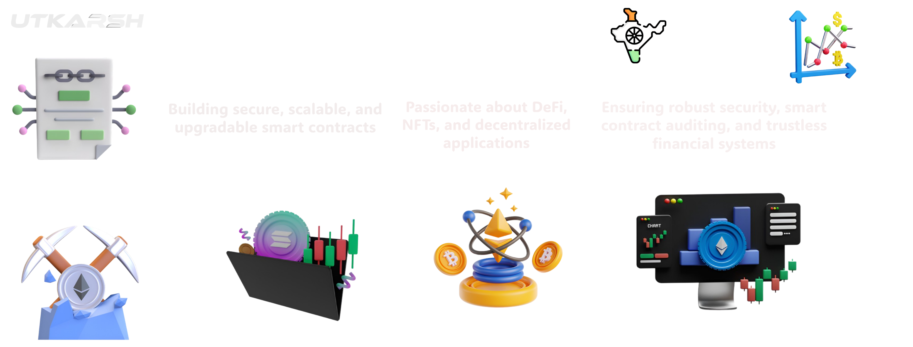

<h1 align="center">
  
</h1>

<h1 align="center">Hi 👋 I'm Utkarsh Srivastava</h1>

Building the future of Web3 & Blockchain from India 🇮🇳 | Smart Contracts, DApps, and Decentralized Innovation 🚀

<table width="100%">
  <tr>
    <td width="60%" valign="top">

### About Me
- 🔭 I’m currently working on **Autonomous AI Agent that can perfrom on chain actions**
- 🌱 I’m currently learning **Smart Contract Security, Smart Contract DevOps, Vyper**
- 📫 How to reach me **utkarshzz007@gmail.com or utkarshzzz007@gmail.com**
- ⚡ Fun fact **Utkarsh loves diving into Web3 and blockchain, but secretly wishes there was a smart contract to automate making chai! ☕🚀**

### Connect with me

  
  
  
  
  

    </td>
    <td width="40%" valign="top" align="center">
      
    </td>
  </tr>
</table>

---

### Languages and Tools

  
  
  
  
  
  
  
  
  
  
  
  
  
  
  
  
  
  
  

---

  

  

