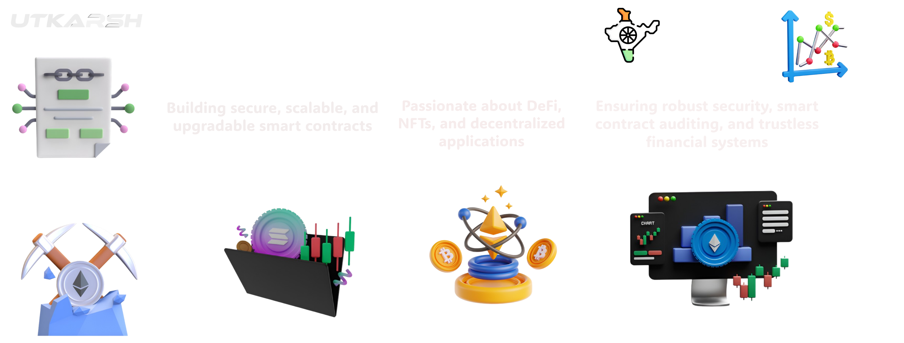

<h1 align="center">
  
</h1>

<h1 align="center">Hi 👋 I'm Utkarsh Srivastava</h1>
<h3 align="center">Building the future of Web3 & Blockchain from India 🇮🇳 | Smart Contracts, DApps, and Decentralized Innovation 🚀</h3>

    
  

- 🔭 I’m currently working on **Decentralized Exchange**

- 🌱 I’m currently learning **Smart Contract Security, Smart Contract DevOps, Vyper**

- 📫 How to reach me **utkarshzz007@gmail.com or utkarshzzz007@gmail.com**

- ⚡ Fun fact **Utkarsh loves diving into Web3 and blockchain, but secretly wishes there was a smart contract to automate making chai! ☕🚀**

<h3 align="left">Connect with me:</h3>

<h3 align="left">Languages and Tools:</h3>

                    

<a href="https://git.io/streak-stats">

